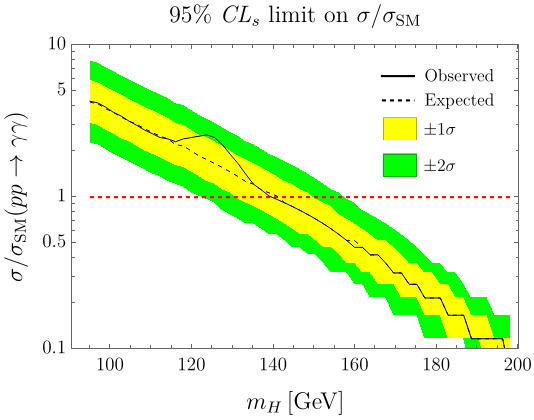

# A statistics lesson from the Higgs discovery

This project is an exercise on advanced statistics that originates from the real world problem of particle phenomenology. Specifically, we emulate the hypothesis testing that was pertinent in the episode of the discovery of the Higgs boson, one of the greatest achievements in the history of science. Our final goal is to obtain 95% mass limits through the so-called _modified frequentist confidence level method_, or, $CL_s$. The roadmap to obtain the resulting inference is as follows:

  1. _Simulation_: this is the stage in which major physics was needed. We focused only on the di-gamma end state. Without getting into much of the technical details, we utilized bash scripting to run MadGraph as needed and generate 106 background events (SM without Higgs) at each invariant mass; 106 signal events (with unknown Higgs mass); and, to emulate the observed line, generated more 106 events for each bin of the &gamma;&gamma; invariant mass assuming a 125 GeV Higgs. The model is implemented into MadGraph through a UFO generated with the help of FeynRules, and the implementation of the NLO effective H&gamma;&gamma; vertex is taken from rom the [FeynRules model database](https://feynrules.irmp.ucl.ac.be/wiki/ModelDatabaseMainPage). The cross sections from the dozens of runs in each mass point are collected with the help of bash scripting and their average are stored in the files within the `Cross_Sections` folder.

  2. _Statistics_: The $\\mathit{CL_s}$ procedure is performed through the `stats_CLs` Mathematica code in a functional and hands-on manner. A Poisson distribution is assumed for the number of events in each bin, with the average cross section obtained from the pseudo-experiments as median. We take advantage of the Neyman-Pearson Lemma and use log-likelihood ratio (LLR) as test statistic. We then find, for each $m_H$, the exclusion threshold, i.e., what is the strength parameter $\mu$ (interpreted as $\\sigma/\\sigma_{\\mathrm{SM}}$) for which $\\mathit{CL_s}=0.05$, where $$CL_s(m) = \frac{P(\mathrm{LLR}\lt m)}{P(\mathrm{LLR}_{\mathrm{SM}}\lt m)}$$.

3. _Plotting_: We plot the result, together with the one and two standard deviations bands -- all done in the `plotting.nb` Mathematica notebook. The result, finally, appears below

